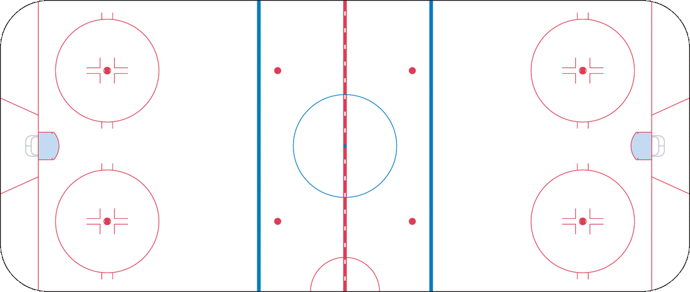

# IFT6758 Repo Template

This template provides you with a skeleton of a Python package, `ift6758`, that is installed into your project environment.
You are encouraged to leverage this package as a skeleton and add all of your reusable code, functions, etc. into relevant modules.
This makes collaboration much easier as the package could be seen as a "single source of truth" to pull data, create visualizations, etc. rather than relying on a jumble of notebooks.
You can still run into trouble if branches are not frequently merged as work progresses, so try to not let your branches diverge too much!

Also included in this repo is an image of the NHL ice rink that you can use in your plots.
It has the correct location of lines, faceoff dots, and length/width ratio as the real NHL rink.
Note that the rink is 200 feet long and 85 feet wide, with the goal line 11 feet from the nearest edge of the rink, and the blue line 75 feet from the nearest edge of the rink.

<p align="center">

<p>

The image can be found in [`./figures/nhl_rink.png`](./figures/nhl_rink.png).

## Setup

This project uses [uv](https://docs.astral.sh/uv/) to manage Python, dependencies and the virtual environment.
Install it by following the [installation guide](https://docs.astral.sh/uv/getting-started/installation/).

Then, from the root of the repository:

    uv sync

This creates a `.venv/` folder with a compatible Python version (see `requires-python` in `pyproject.toml`), installs the dependencies locked in `uv.lock`, and installs the `ift6758` package in editable mode (changes to the code are picked up without reinstalling).

Run anything inside the environment with `uv run`:

    uv run jupyter lab
    uv run python my_script.py

Jupyter launched this way already uses the project environment, so there is no kernel to register.
If you use another editor, point its Python interpreter / notebook kernel to the `.venv/` environment.

### Managing dependencies

Add or remove packages with `uv` rather than `pip`, so that `pyproject.toml` and `uv.lock` stay up to date:

    uv add scikit-learn          # runtime dependency
    uv add --dev pytest          # development-only dependency
    uv remove scikit-learn

Commit both `pyproject.toml` and `uv.lock`; teammates then just run `uv sync` to get the exact same environment.

## LLM setup

All LLM tasks must use [Qwen3-4B-Instruct-2507](https://huggingface.co/Qwen/Qwen3-4B-Instruct-2507).
A loading function is provided in [`ift6758/llm/qwen.py`](./ift6758/llm/qwen.py):

```python
from ift6758.llm import load_model

model, tokenizer = load_model()
```

Running it with a GPU is recommended.
See the [model card](https://huggingface.co/Qwen/Qwen3-4B-Instruct-2507) for how to prompt the model and the recommended generation settings.

### Running locally

The LLM dependencies (`torch`, `transformers`, ...) are an optional extra, so install them with:

    uv sync --extra llm

To check that everything works (the first run downloads ~8 GB of weights to the Hugging Face cache):

    uv run python -m ift6758.llm.qwen

### Running on Google Colab

The suggested environment is a Colab T4 GPU.
Colab notebooks run in Colab's own Python environment rather than uv.
[`notebooks/LLM setup.ipynb`](./notebooks/LLM%20setup.ipynb) installs the same package versions as `uv.lock` on Colab, clones your repository, and loads the model; use it as a starting point for your LLM notebooks.
